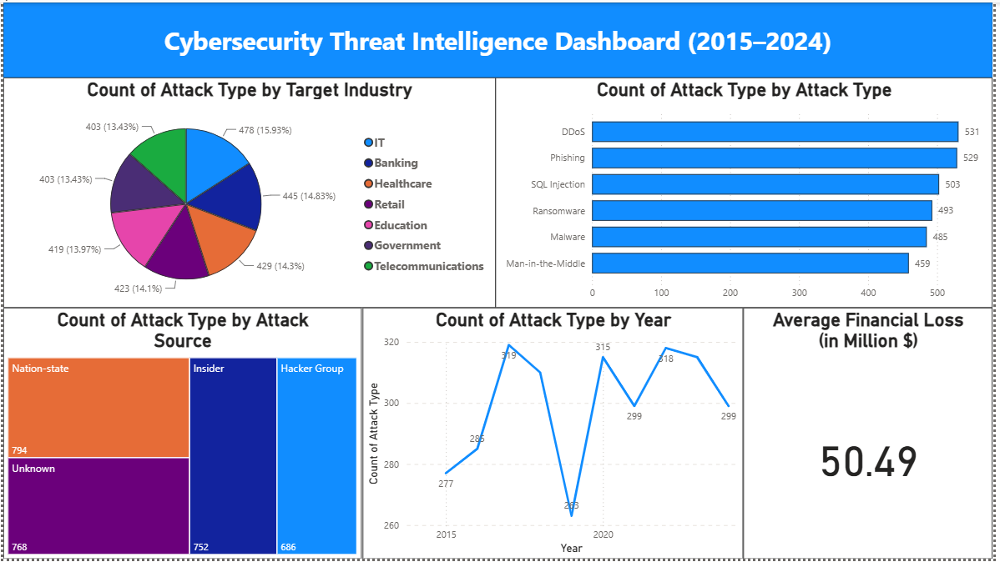

# Power BI Cybersecurity Threat Intelligence Dashboard

An interactive Power BI dashboard analyzing global cybersecurity threats from 2015 to 2024.

## 📊 Project Overview

This project analyzes global cybersecurity incidents using Power BI to identify patterns and trends across attack types, target industries, attack sources, yearly incidents, and financial losses.

## 🛠️ Tools & Technologies

- Microsoft Power BI
- DAX
- Data Modeling
- Data Visualization
- Analytical Storytelling

## 📈 Dashboard Analysis

The dashboard provides insights into:

- Attack types and their frequency
- Targeted industries
- Attack sources
- Yearly cybersecurity incident trends
- Average financial losses

## 🔍 Key Insights

- DDoS and Phishing are among the most frequent attack types.
- IT and Banking are among the major targeted industries.
- Attack sources include Nation-state, Insider, Hacker Group, and Unknown.
- Cybersecurity incidents vary across the 2015–2024 period.
- The dashboard provides an overview of financial impact through average financial loss.

## 🖼️ Dashboard Preview

## 📂 Project Files

| File | Description |
|---|---|
| `dashboard.pbix` | Power BI dashboard file |
| `dashboard.png` | Dashboard screenshot |
| `README.md` | Project documentation |

## 📚 Dataset

**Global Cybersecurity Threats (2015–2024)**

The dataset contains information about cybersecurity incidents across different years, attack types, industries, attack sources, and financial impact.

**Source:** Kaggle

## 🎯 Project Purpose

This project was created to practice and demonstrate skills in:

- Data analysis
- Power BI dashboard development
- DAX
- Data visualization
- Analytical storytelling
